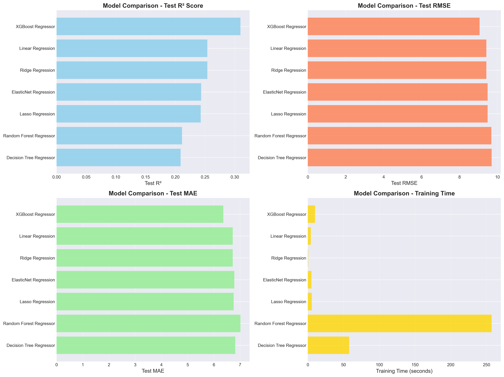
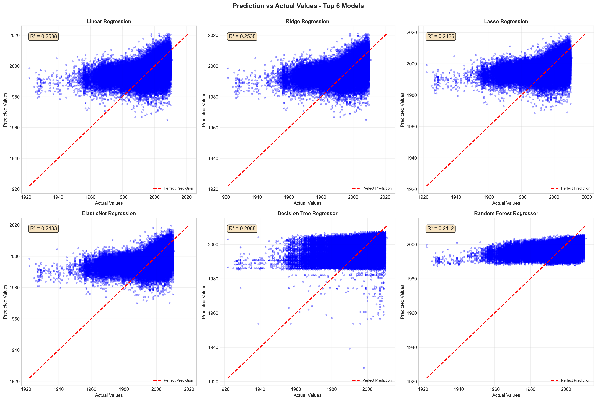
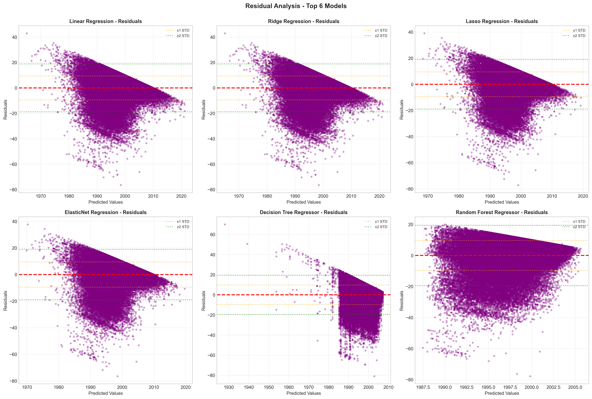

# 🎵 Song Year Prediction - Machine Learning Project

A comprehensive machine learning project for predicting song release years using regression models. This project includes exploratory data analysis, data preprocessing, multiple model training, and detailed model evaluation.

## 📋 Table of Contents

- [Project Overview](#project-overview)
- [Dataset](#dataset)
- [Project Structure](#project-structure)
- [Installation](#installation)
- [Usage](#usage)
- [Models Implemented](#models-implemented)
- [Results](#results)
- [Visualizations](#visualizations)
- [Key Findings](#key-findings)
- [Future Improvements](#future-improvements)

## 🎯 Project Overview

This project aims to predict song release years based on audio features using multiple regression algorithms. The workflow includes:

1. **Exploratory Data Analysis (EDA)** - Understanding data distribution, correlations, and patterns
2. **Data Preprocessing** - Handling missing values, outliers, and feature scaling
3. **Model Training** - Training 10 different regression models
4. **Model Evaluation** - Comprehensive evaluation using multiple metrics
5. **RAPIDS GPU Acceleration** - Optional GPU-accelerated versions for faster processing

## 📊 Dataset

- **Source**: `midterm-regresi-dataset.csv`
- **Type**: Regression problem
- **Target Variable**: Song release year (first column)
- **Features**: Various audio features and song characteristics
- **Split**: 80% training, 20% testing

### Data Preprocessing Steps

1. **Missing Value Handling**: Imputation strategies applied
2. **Outlier Detection**: Statistical methods used to identify and handle outliers
3. **Feature Scaling**: Three scaling methods implemented:
   - StandardScaler (recommended)
   - MinMaxScaler
   - RobustScaler

## 📁 Project Structure

```
Regression/
├── 📓 Notebooks
│   ├── EDA.ipynb                          # Exploratory Data Analysis
│   ├── Model_Training.ipynb               # Model training pipeline
│   ├── Model_Evaluation.ipynb             # Comprehensive model evaluation
│   ├── EDA_RAPIDS.ipynb                   # GPU-accelerated EDA
│   ├── Model_Training_RAPIDS.ipynb        # GPU-accelerated training
│   └── Model_Evaluation_RAPIDS.ipynb      # GPU-accelerated evaluation
│
├── 📁 Data Files
│   ├── midterm-regresi-dataset.csv        # Original dataset
│   ├── songs_processed.csv                # Processed dataset
│   ├── songs_scaled_standard.csv          # StandardScaler output
│   ├── songs_scaled_minmax.csv            # MinMaxScaler output
│   ├── songs_scaled_robust.csv            # RobustScaler output
│   ├── X_features.csv                     # Feature matrix
│   ├── X_features_scaled.csv              # Scaled features
│   └── y_target.csv                       # Target variable
│
├── 🤖 Model Files
│   ├── model_linear_regression.pkl
│   ├── model_ridge_regression.pkl
│   ├── model_lasso_regression.pkl
│   ├── model_elasticnet_regression.pkl
│   ├── model_decision_tree.pkl
│   ├── model_random_forest.pkl
│   ├── model_xgboost.pkl
│   └── all_model_results.pkl              # All results combined
│
├── 📊 Results & Metrics
│   ├── model_results.csv                  # Performance summary
│   ├── detailed_model_metrics.csv         # Detailed metrics
│   ├── model_ranking.csv                  # Ranked models
│   ├── model_comparison.png               # Visual comparison
│   ├── comprehensive_model_evaluation.png # Full evaluation charts
│   ├── prediction_vs_actual.png           # Prediction accuracy plots
│   ├── residual_analysis.png              # Residual plots
│   └── error_distribution.png             # Error distribution
│
├── 🔧 Scalers
│   ├── standard_scaler.pkl
│   ├── minmax_scaler.pkl
│   └── robust_scaler.pkl
│
└── 📄 Documentation
    ├── README.md                          # This file
    ├── RAPIDS_SETUP_GUIDE.md              # GPU setup guide
    └── RAPIDS_COMPLETENESS_VERIFICATION.md # RAPIDS checklist
```

## 🛠️ Installation

### Prerequisites

```bash
Python 3.8+
pip or conda
```

### Required Libraries

```bash
# Core libraries
pip install numpy pandas scikit-learn

# Visualization
pip install matplotlib seaborn

# Additional models
pip install xgboost

# Data profiling
pip install skimpy

# Environment management
pip install python-dotenv

# Statistical analysis
pip install scipy
```

### Optional: RAPIDS GPU Acceleration

For GPU-accelerated processing, follow the [RAPIDS_SETUP_GUIDE.md](RAPIDS_SETUP_GUIDE.md) for detailed installation instructions.

```bash
# Create conda environment with RAPIDS
conda create -n rapids-env -c rapidsai -c conda-forge -c nvidia \
    rapids=23.10 python=3.10 cudatoolkit=11.8
```

## 🚀 Usage

### 1. Exploratory Data Analysis

```bash
jupyter notebook EDA.ipynb
```

Run this notebook first to:
- Understand data distribution
- Identify missing values and outliers
- Analyze feature correlations
- Generate initial insights

### 2. Model Training

```bash
jupyter notebook Model_Training.ipynb
```

This notebook will:
- Load preprocessed data
- Train 10 different regression models
- Save trained models
- Generate performance metrics
- Create comparison visualizations

### 3. Model Evaluation

```bash
jupyter notebook Model_Evaluation.ipynb
```

This notebook provides:
- Comprehensive metrics (RMSE, MAE, R², MAPE)
- Prediction vs Actual plots
- Residual analysis
- Error distribution analysis
- Model ranking and recommendations

## 🤖 Models Implemented

| # | Model | Type | Use Case |
|---|-------|------|----------|
| 1 | Linear Regression | Baseline | Fast, interpretable baseline model |
| 2 | Ridge Regression | Regularized | L2 regularization, reduces overfitting |
| 3 | Lasso Regression | Regularized | L1 regularization, feature selection |
| 4 | ElasticNet | Regularized | Combined L1+L2 regularization |
| 5 | Decision Tree | Tree-based | Non-linear relationships |
| 6 | Random Forest | Ensemble | Robust, handles outliers well |
| 7 | Gradient Boosting | Ensemble | Sequential boosting, high accuracy |
| 8 | XGBoost | Ensemble | Optimized gradient boosting |
| 9 | SVR | Kernel-based | Non-linear patterns (subset training) |
| 10 | K-Nearest Neighbors | Instance-based | Local pattern learning |

## 📈 Results

### Model Performance Summary

| Model | Test R² | Test RMSE | Test MAE | Training Time (s) |
|-------|---------|-----------|----------|-------------------|
| **XGBoost Regressor** | **0.3095** | **9.0538** | **6.3614** | 10.15 |
| Linear Regression | 0.2538 | 9.4113 | 6.7181 | 4.17 |
| Ridge Regression | 0.2538 | 9.4114 | 6.7181 | 0.49 |
| ElasticNet | 0.2433 | 9.4777 | 6.7786 | 5.13 |
| Lasso | 0.2426 | 9.4818 | 6.7564 | 5.61 |
| Random Forest | 0.2112 | 9.6766 | 7.0120 | 257.08 |
| Decision Tree | 0.2088 | 9.6912 | 6.8158 | 57.85 |

### Best Models

🏆 **Production Model**: XGBoost Regressor
- **R² Score**: 0.3095
- **RMSE**: 9.05
- **MAE**: 6.36
- **Reason**: Highest R² score with excellent generalization

⚡ **Fastest Model**: Ridge Regression
- **Training Time**: 0.49s
- **R² Score**: 0.2538
- **Good for**: Real-time applications and rapid prototyping

## 📊 Visualizations

The project generates comprehensive visualizations:

### 1. Model Comparison
R² Score comparison, RMSE comparison, MAE comparison, and training time comparison across all models.



### 2. Comprehensive Evaluation
6-panel comparison of all metrics including R² scores with values, RMSE, MAE, MAPE comparisons, training time analysis, and overall performance score (0-100).


### 3. Prediction Analysis
Top 6 models' predictions vs actual values with perfect prediction line, R² scores annotated, and visual assessment of model accuracy.



### 4. Residual Analysis
Residual plots for top 6 models with standard deviation bands (±1σ, ±2σ), pattern identification, and homoscedasticity check.



### 5. Error Distribution
Histogram of residuals with normal distribution fit, statistical properties, and zero-error reference line.


## 🔍 Key Findings

### Model Performance Insights

1. **XGBoost dominates**: Achieved the best R² (0.3095) and lowest errors
2. **Linear models are competitive**: Ridge and Linear Regression performed surprisingly well
3. **Ensemble methods vary**: Random Forest underperformed compared to XGBoost
4. **Speed vs Accuracy tradeoff**: Ridge Regression offers best speed-accuracy balance

### Data Insights

- **Feature Scaling Impact**: StandardScaler provided best results
- **Model Complexity**: More complex models didn't always perform better
- **Training Time**: Varies dramatically (0.49s to 257s)

### Recommendations

✅ **For Production**: Use XGBoost Regressor
- Best accuracy
- Reasonable training time
- Good generalization

✅ **For Development**: Use Ridge Regression
- Fastest training
- Decent accuracy
- Easy to interpret

✅ **For Experimentation**: Continue with ensemble methods
- Try hyperparameter tuning
- Consider feature engineering
- Explore more advanced techniques

## 🎯 Evaluation Metrics Explained

- **R² (Coefficient of Determination)**: 0-1 scale, higher is better
  - Measures proportion of variance explained by the model
  - 0.31 means model explains 31% of price variance

- **RMSE (Root Mean Squared Error)**: Lower is better
  - Average magnitude of errors
  - Penalizes large errors more heavily

- **MAE (Mean Absolute Error)**: Lower is better
  - Average absolute difference between predicted and actual
  - More interpretable than RMSE

- **MAPE (Mean Absolute Percentage Error)**: Lower is better
  - Percentage-based error metric
  - Scale-independent comparison

## 🚀 Future Improvements

### Model Enhancements
- [ ] Hyperparameter tuning with GridSearchCV/RandomizedSearchCV
- [ ] Feature engineering (polynomial features, interactions)
- [ ] Ensemble stacking methods
- [ ] Neural network models
- [ ] Cross-validation for more robust evaluation

### Data Processing
- [ ] Advanced outlier detection methods
- [ ] Feature importance analysis
- [ ] Dimensionality reduction (PCA, t-SNE)
- [ ] Handle categorical variables more effectively

### Infrastructure
- [ ] Deploy model as REST API
- [ ] Create web interface for predictions
- [ ] Implement model monitoring
- [ ] Add automated retraining pipeline
- [ ] Docker containerization

### Analysis
- [ ] SHAP values for model interpretability
- [ ] Partial dependence plots
- [ ] Learning curves
- [ ] Bias-variance tradeoff analysis

## 📝 Notes

- **Verbose Training**: Models with verbose output show detailed training progress
- **GPU Acceleration**: RAPIDS notebooks provide 10-100x speedup on compatible hardware
- **Model Persistence**: All trained models are saved as `.pkl` files for reuse
- **Reproducibility**: Random state = 42 ensures reproducible results

## 🤝 Contributing

This project is part of a Machine Learning course. Feel free to:
- Report issues
- Suggest improvements
- Fork and experiment
- Share insights

## 📜 License

This project is for educational purposes.

---

